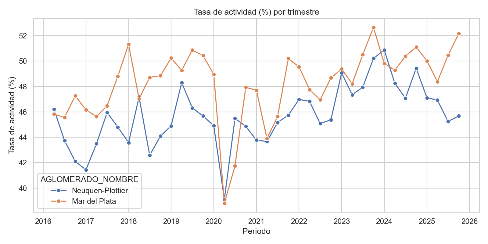
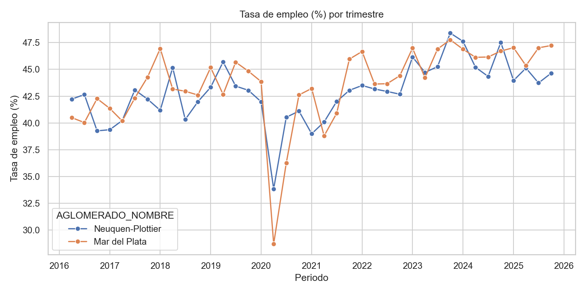
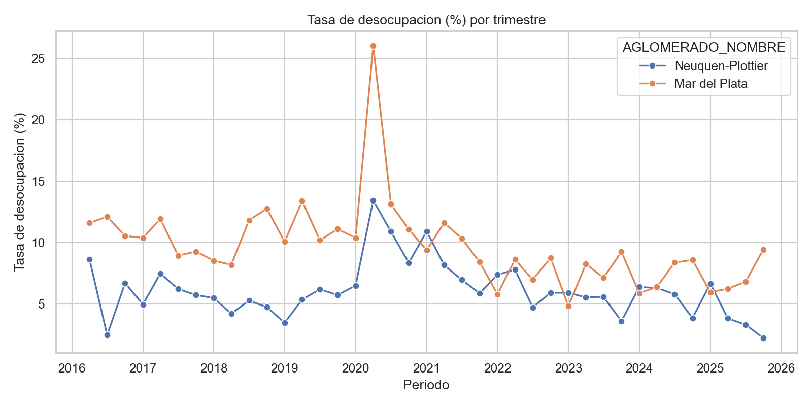
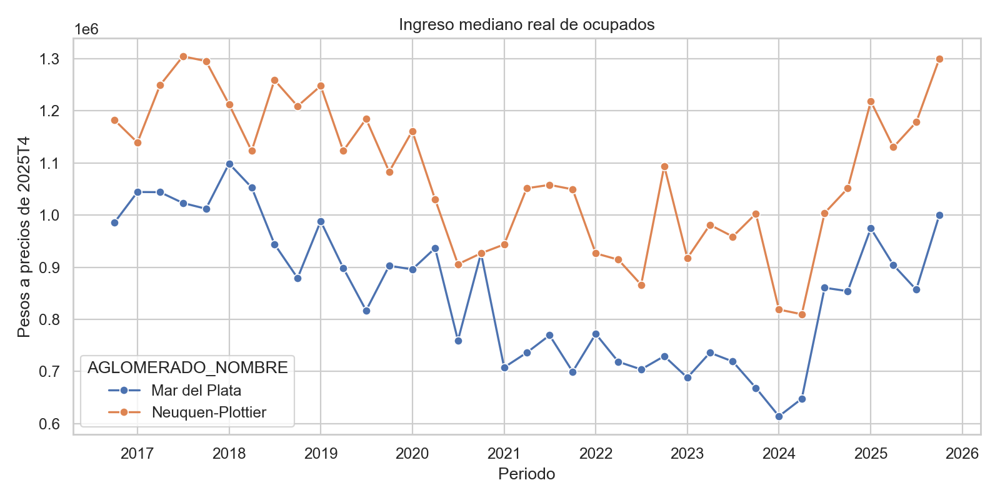
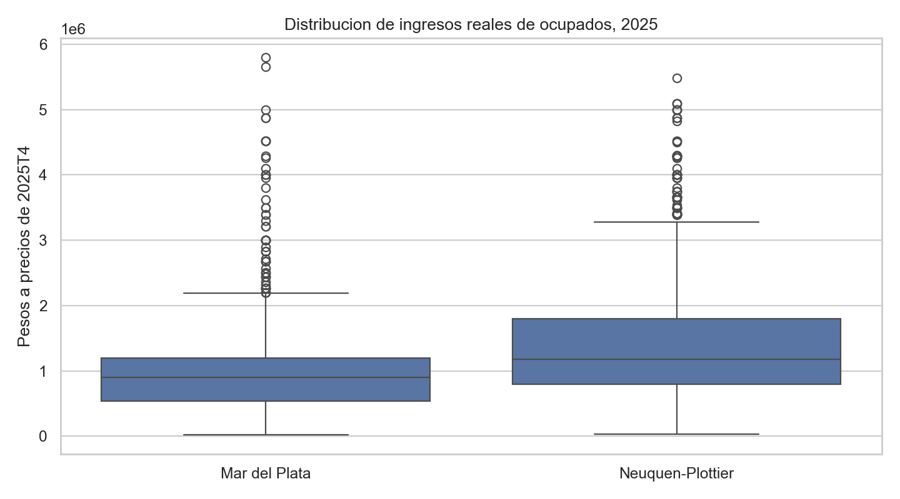
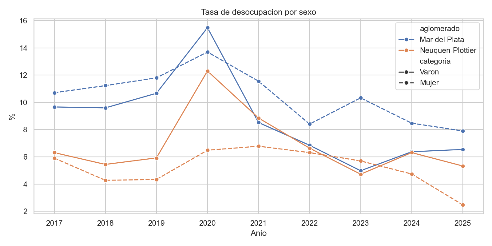
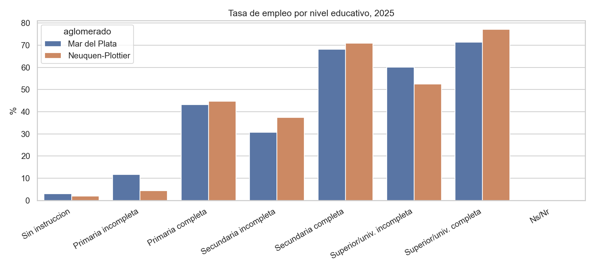

# Evolucion del mercado laboral e ingresos: Neuquen-Plottier vs Mar del Plata

## 1. Introduccion

Este informe analiza la evolucion de la tasa de actividad, la tasa de empleo, la tasa de desocupacion y los ingresos de la poblacion en dos aglomerados urbanos relevados por la EPH: Neuquen-Plottier y Mar del Plata. El periodo cubierto por las bases descargadas es 2016T2-2025T4. La comparacion combina una lectura temporal de los indicadores laborales con un analisis de ingresos reales, variables sociodemograficas y un modelo inicial de imputacion de ingresos.

## 2. Datos y metodologia

La fuente principal son los microdatos de la Encuesta Permanente de Hogares (EPH) publicados por INDEC. Se utilizan las bases de personas para el periodo 2016T2-2025T4. Los codigos de aglomerado empleados son 17 para Neuquen-Plottier y 34 para Mar del Plata. Las tasas laborales se calculan con el ponderador `PONDERA`. Para los ingresos de ocupados se usa `P21`, ponderado con `PONDIIO` cuando esta disponible.

La tasa de actividad se calcula como PEA sobre poblacion total ponderada; la tasa de empleo como ocupados sobre poblacion total ponderada; y la tasa de desocupacion como desocupados sobre PEA. Para ingresos reales se usa el IPC Nivel General Nacional, base diciembre 2016, publicado por INDEC/datos.gob.ar. Como la serie nacional mensual comienza en diciembre de 2016, el analisis de ingresos reales comienza efectivamente en 2016T4. Los valores se expresan a precios de 2025T4.

## 3. Evolucion de los indicadores laborales

La comparacion muestra trayectorias laborales con oscilaciones importantes entre 2016 y 2025. El periodo 2020 se destaca por el impacto de la pandemia, visible en la caida de observaciones y en movimientos fuertes de actividad y empleo. La lectura comparativa debe hacerse mirando tanto niveles como cambios: Mar del Plata suele mostrar una estructura laboral sensible a estacionalidad y servicios, mientras que Neuquen-Plottier esta atravesado por el peso de actividades energeticas y dinamicas regionales patagonicas.

## 4. Ingresos reales

El ingreso mediano real permite observar la capacidad de compra de los ocupados una vez descontada la inflacion. Se prioriza la mediana por sobre la media porque los ingresos presentan alta asimetria y valores extremos. El boxplot de 2025 muestra que la dispersion de ingresos es considerable en ambos aglomerados, por lo que la comparacion no debe limitarse al promedio.

## 5. Analisis por subgrupos

El analisis por sexo y nivel educativo permite ver heterogeneidades que quedan ocultas en las tasas agregadas. En general, la insercion laboral tiende a mejorar con el nivel educativo, mientras que la desocupacion por sexo puede mostrar brechas persistentes. Estas diferencias son relevantes para interpretar si la evolucion agregada se explica por mejoras generalizadas o por cambios concentrados en ciertos grupos.

## 6. Exploracion univariada y no respuesta

La tabla `outputs/tables/resumen_univariado.csv` resume faltantes, percentiles y posibles valores atipicos para variables clave. En ingresos, la no respuesta requiere tratamiento especifico. En este primer corte se considera no respuesta operativa de ingresos en ocupados cuando `P21` es faltante o negativo. Los ingresos iguales a cero no se imputan automaticamente, ya que pueden corresponder a ocupados sin ingreso laboral monetario declarado en el periodo.

## 7. Modelo de imputacion de ingresos

Antes del modelo de imputacion se estimaron dos modelos de regresion lineal vistos en clase. El primero es una regresion lineal simple, donde el logaritmo del ingreso real se explica unicamente por la edad. El segundo es una regresion lineal multiple, donde se incorporan edad, sexo, nivel educativo, aglomerado, anio, trimestre, rama de actividad (`PP04B_COD`) y ocupacion (`PP04D_COD`). Estos modelos permiten mostrar como mejora la capacidad explicativa cuando se pasa de una relacion bivariada a una especificacion multivariada.

| Modelo | n train | n test | MAE | RMSE | R2 original |
|---|---:|---:|---:|---:|---:|
| Regresion lineal simple: log(P21 real) ~ edad | 18395 | 6132 | 615552 | 1003449 | -0.103 |
| Regresion lineal multiple: log(P21 real) ~ edad + sexo + educacion + aglomerado + periodo + rama + ocupacion | 18395 | 6132 | 443112 | 773494 | 0.344 |

Para la imputacion de no respuesta se ajusto ademas un modelo Ridge sobre el logaritmo del ingreso real de la ocupacion principal (`log(P21_REAL)`). Ridge mantiene una estructura lineal, pero agrega regularizacion para reducir la inestabilidad de coeficientes cuando hay muchas categorias de rama y ocupacion. El modelo se entreno con ocupados con ingreso positivo y se evaluo con una particion train/test. Luego se aplico a los ocupados con `P21` faltante o negativo para generar ingresos imputados.

Metricas principales:

| Modelo | n train | n test | MAE | RMSE | R2 original |
|---|---:|---:|---:|---:|---:|
| Ridge sobre log(P21 real) | 18395 | 6132 | 438927 | 765421 | 0.358 |

La interpretacion de coeficientes debe hacerse en terminos aproximados de cambios porcentuales sobre el ingreso real. La tabla `outputs/tables/modelo_imputacion_coeficientes_top.csv` lista los efectos de mayor magnitud. La tabla `outputs/tables/ingresos_reales_imputados_trimestrales.csv` compara la mediana de ingresos original con la mediana luego de imputar no respuesta. Al tratarse de un modelo lineal regularizado, su principal ventaja es la interpretabilidad; su limite es que puede no capturar no linealidades complejas del mercado laboral.

## 8. Sintesis comparativa

La tabla `outputs/tables/resumen_inicial_final.csv` resume el primer y ultimo periodo observado para tasas laborales e ingresos reales. Como primer resultado, el trabajo muestra que ambos aglomerados atravesaron cambios laborales relevantes en el periodo, con una ruptura visible durante 2020 y una recomposicion posterior. La comparacion de ingresos reales muestra una evolucion condicionada por la alta inflacion del periodo, por lo que el ajuste por IPC es imprescindible para evitar conclusiones nominales engañosas.

## 9. Limitaciones y proximos ajustes

Esta version es una base de trabajo. Quedan tres puntos para revisar con cuidado: confirmar con el diseno de registro la codificacion exacta de no respuesta de ingresos; decidir si se usa IPC nacional o algun IPC regional/provincial para sensibilidad; y seleccionar los graficos finales para que el informe quede entre 6 y 10 paginas.
